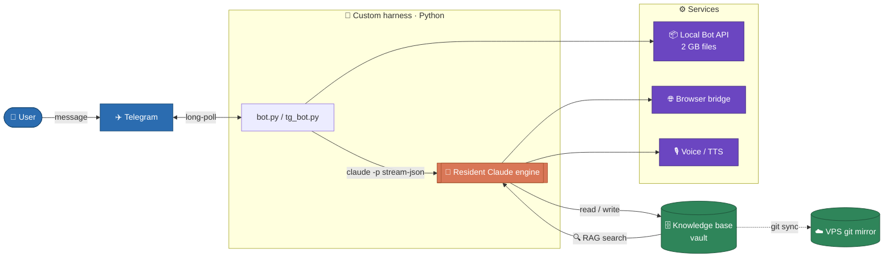

# claude-telegram-orchestrator

> A personal AI assistant that lives in Telegram — a **custom harness** (orchestration
> layer) that drives a long-lived **Claude Code** agent as its engine.


🇷🇺 [Русская версия](README.ru.md)

The bot is the transport and control layer; all reasoning and tool use happen inside a
long-lived `claude -p` process. Built and hardened over ~2 months of daily use, it runs
on a VPS and a Mac in sync, and serves several separate users from one shared skill
pool.

## TL;DR

- **One agent per chat, kept warm** — the ~6-second cold start is paid once, not on
  every message. Idle residents are reaped; the thread survives via session resume.
- **A shared core, several owners.** 15 modules, ~6,800 lines, zero personal values
  inside — a new owner is a config file, not a fork. Enforced by a test that sweeps
  every module for names, home paths and chat ids.
- **Semantic search over a personal knowledge base** in **0.1–0.8s**, locally, with
  **no GPU and no external API**. Vectors live as a matrix in RAM; the disk is not
  touched on a query.
- **Incremental indexing that actually works.** Appending a line to a 256 KB journal
  re-embeds **1 chunk instead of 110** — a two-sided diff plus per-chunk ordinals.
- **Deterministic behaviour in code** (action markers + hooks), not left to the
  model's whim: dangerous actions are proposals awaiting confirmation.
- **Two-way sync** where the remote address is never hardcoded — it comes from the
  profile, or is asked of git itself.

## Architecture



## What's in this repository

| File / folder | What it is |
| --- | --- |
| `bot.py` | A **minimal** orchestrator (~150 lines) — the core loop in its clearest form: long-poll, one resident per chat, stream the reply back. Start reading here. |
| `core/` | The **production core**: 15 modules, shared by every owner on the machine. Entry point `tg-bot.py`, then `intake` → `turn` → `claude_run`. See [`core/ARCHITECTURE.md`](core/ARCHITECTURE.md). |
| `vault_rag/` | The semantic search engine — hybrid (vector + full-text), local, GPU-free, with a warm daemon serving several vaults at once. ([how and why](docs/rag-search.md)) |
| `deploy/` | systemd unit, the sync package, a full profile example. |
| `docs/` | Deep dives: [search](docs/rag-search.md), [sync](docs/sync.md). |
| `tests/` | Pure-function tests and seam tests, including the isolation sweep. |
| `vault_example/` | A de-personalized skeleton of the knowledge base (structure + rules, no content). |
| `infra/` | Deployment examples: own Bot API server (Docker), systemd units, the voice shim. |
| `deep_research/` | A browser bridge: drives a stealth browser on the server to use a web-UI-only feature and read the result back. |
| `prompts/` | A sanitized example system prompt — the *shape* of the rules without private content. |

> **Not included by design:** skills and behavioural hooks. They carry the owner's
> entire working methodology — the part that cannot be anonymised without turning into
> an empty husk. They are described in the sections below instead.

## How it works

Each feature is described first **in plain English**, then with the technical detail.

### Keeping the agent fast
*Plain English:* instead of starting the assistant from scratch on every message, it
stays "awake" between messages, so replies come quickly.
*Technical:* one `claude -p --input-format stream-json` process is kept resident per
chat. A watchdog thread kills it on a turn/silence timeout so a stalled tool-call can't
hang the bot. A new message mid-answer **interrupts** the current turn (not kills it)
and starts a new one on the same process, preserving session history.

*Measured (live logs):* wrapper overhead from message receipt to model start is **~0.1s**
(114–119 ms on text). Time-to-first-token (**~4.5–12s** on Opus, cache-warm) is set by the
model, not the wrapper — the resident process keeps our own overhead negligible.

### Keeping the agent honest (fixing model drift)
*Plain English:* a set of automatic checks nudge the assistant to verify facts, stay
brief, and not invent things — so it stays reliable over long use.
*Technical:* ~30 hooks fire on triggers and inject guidance — `honesty-gate`,
`ground-truth-gate` (check the source before claiming), `terse-gate`,
`simple-language-gate`, `verify-plan-gate` (plan + approval before edits),
`audit-gate`. Plus safety (`safety.sh` blocks dangerous shell, `tg-write-gate` gates
outbound messages), `precompact-backup`, `auto-commit-flush`.

### Grounded answers (search over a knowledge base)
*Plain English:* the assistant can find anything in a personal notes vault — "where did
I write about X" — instead of guessing.
*Technical:* hybrid search — vector (a multilingual MiniLM embedder via `fastembed`, CPU
only) + full-text (`SQLite FTS5`), merged with reciprocal-rank fusion. A warm daemon
keeps the model loaded and answers in under ~0.6s; a turn-end hook re-indexes after each
change so search is always instant. ([details](vault_rag/README.md))

### Long-term memory & hot rules
*Plain English:* the assistant remembers preferences and facts across sessions, and
picks up rule changes without a restart.
*Technical:* a `memory/` folder of notes the agent reads and writes; a "constitution"
of behaviour files; on a rule-file change the bot injects the diff at the start of the
next turn — no restart, no dropped thread.

### Durable across machines
*Plain English:* work is never lost — everything syncs between the laptop and the
server automatically.
*Technical:* a bare git repo is the transport; both sides sync around every message,
with a rescue commit before each merge and per-machine log files.

### Telegram infrastructure (built, not off-the-shelf)
*Plain English:* custom plumbing so the bot can send big files, talk as the owner, do
voice, calendar, and run long jobs that report back when done.
*Technical:*
- **Own Bot API server** (local mode) — 2 GB file limit; one server, many bots.
- **Own Telegram MCP server** — a user session that can message any chat as the owner,
  send voice/files/reactions, edit and delete (beyond the Bot API's limits).
- **Voice transcription with fallbacks** — in production the primary path is Groq
  Whisper; this extract ships the native Telegram path (`transcribe_native.py`), with an
  optional local faster-whisper shim and AssemblyAI as fallbacks.
- **Text-to-speech**, **Google Calendar** (two-stage create), **attachments**
  (auto-save + confirm/drop), **inline menu**, **background jobs** that self-notify.

### A capability pool
*Plain English:* 53 ready commands — research, transcription, content generation,
scrapers, the note funnel.
*Technical:* skills (slash-commands) including a stealth-browser bridge past Cloudflare,
call-record pull + diarised transcription, listings scrapers, media pulls
(Instagram/YouTube), and a 3-agent `/audit` (vault + web + challenger) run before
architectural decisions.


### What a plain Claude Code wrapper doesn't have

A plain wrapper takes text from Telegram, hands it to the model, prints the reply.
Everything below is what makes a messenger a workable place instead of a demo.

**Action markers — the bot acts instead of narrating.** The model can end a reply with
a marker line, and the core turns it into a deterministic action: `__WROTE__` (saved to
notes, with the file shown), `__CHOICES__` (buttons grow under the message), `__TASK__`
(caught a task, into the list), `__TTS__` (speak it), `__BG_TASK__` (work longer than a
turn: run it detached and **message me when done**). Dangerous actions —
`__TG_SEND_PROPOSE__`, `__CAL_PROPOSE__` — are proposals awaiting confirmation, never
autonomous acts. Thirteen markers in total, parsed in `core/markers.py`.

**⏹ STOP that actually stops.** The button sits on the "got it, thinking…" message from
the first second, before the model even starts. Press it and the process dies — while
whatever was already typed **stays in the chat** instead of being thrown away.

**Catch-up: a new message interrupts, not queues.** You add a clarification while the
bot is thinking. A queue would answer the stale question; here the running turn is
interrupted and a fresh one starts with your clarification included. The empty reply of
the interrupted turn is suppressed so no stub lands in the chat.

**A live panel instead of silence.** The "thinking…" message becomes a panel — what it
is doing, how long, how many tools called — edited in place rather than spamming new
messages. Telegram's native draft streaming was tried and dropped: three Android client
glitches; editing proved more reliable.

**Burst merging.** People write one thought as three messages. The core waits for a
pause and merges them into a single turn — otherwise the bot answers a quarter of a
thought three times. Photo albums collapse into one message too.

**Vault navigation by buttons.** Categories, projects, subprojects — browsing notes by
tapping, because typing `Projects/IT/Suppliers/log.md` on a phone is misery.

## Why it's built this way (design decisions)

- **Resident process, not per-message spawn** — traded a bit of memory for killing the
  ~6s cold start on every turn.
- **Local hybrid search, not a hosted vector DB** — no GPU, no per-query API cost, no
  data leaving the box; runs on a small VPS.
- **Behaviour in code (markers + hooks), not in prompts alone** — deterministic actions
  (file writes, buttons, calendar) don't depend on the model complying.
- **Own Bot API server** — the only way to move 2 GB files through Telegram.
- **Two-way git sync with a rescue commit** — an unclean exit can't lose work.


## Measured

Six-core box, 12 GB RAM; vault of ~1,700 notes / 39,000 chunks.

| What | How much |
| --- | --- |
| Wrapper overhead, message receipt → model start | ~0.1 s |
| Cold start of a model process | ~6 s, once per chat |
| Search, idle machine | 0.1–0.8 s |
| Search, six concurrent queries | 0.6–1.3 s |
| Vector stage — matrix in RAM | 0.1–0.4 s |
| Vector stage — when read from disk (before Aug 2026) | 2.7–4.0 s |
| Index in memory | ~60 MB for 39k chunks |
| Search daemon serving all owners | 0.9–1.5 GB |
| Same, old scheme: one daemon per owner | 1.2–1.5 GB **each** |
| Appending to a 256 KB journal | 1 chunk re-embedded, was 110 |
| Core size | 15 modules, ~6,800 lines |

## Tech stack

| Layer | Tools |
| --- | --- |
| Language / runtime | Python 3 (stdlib-first), Linux, systemd |
| Engine | Claude Code headless (`claude -p`, stream-json) — the **Claude Agent SDK** interface |
| Search | `fastembed` (MiniLM, 384-dim), `sqlite-vec`, SQLite FTS5 |
| Telegram | local Bot API server (Docker), Telethon (user session) |
| Browser | patchright (stealth) + Chrome under Xvfb |
| Sync / infra | git (bare remote), Docker, systemd timers |

## What it takes to run

This is a portfolio extract, but it's not a museum piece — `bot.py` actually runs.

- **Just reading the code?** No setup — browse from `bot.py` (the clearest entry point),
  then the architecture diagram and feature sections.
- **Want to run the demo?** Three commands (below). You need: Python 3, a Telegram bot
  token from [@BotFather](https://t.me/BotFather), and the **Claude Code CLI**
  (`claude`) signed in to an Anthropic account — that's the engine the bot drives, so
  it's required by design.
- **The full `tg_bot.py`** is the production build (local Bot API server + more config).
  It's here to show real architecture, not as a one-command install.

## Run

**The minimal bot** (`bot.py`) talks to the standard Telegram API and runs out of the
box — a good place to start:

```bash
cp .env.example .env                 # set at least TELEGRAM_BOT_TOKEN + TELEGRAM_ALLOWLIST
pip install -r requirements.txt
set -a; source .env; set +a
python bot.py
```

It needs the `claude` binary on PATH (the engine) and a Telegram bot token. That's it.

**The full bot** (`tg_bot.py`) is the production version:

- talks to a **local Telegram Bot API server** (2 GB files) — start it from
  [`infra/docker-compose.bot-api.yml`](infra/docker-compose.bot-api.yml) first;
- optional features pull extra packages on demand (e.g. `faster-whisper`);
- semantic search (`vault_rag/`) has its own setup — see
  [`vault_rag/README.md`](vault_rag/README.md).

## Notes

> Claude Code is a dependency (the engine), not part of this repository. This repo is a
> **portfolio extract** of a working personal assistant, with all private data removed —
> names, paths, cabinets and secrets are stubbed or read from the environment. It
> includes the orchestrator, the search engine, the discipline hooks, the skill pool,
> infrastructure examples and a vault skeleton.
