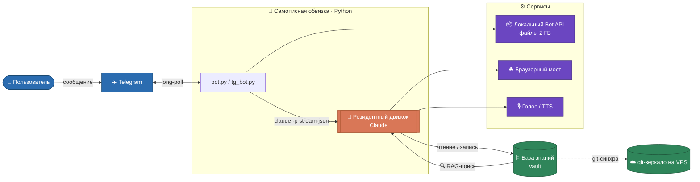

# claude-telegram-orchestrator

> Персональный AI-ассистент, живущий в Telegram — **самописная обвязка (custom
> harness)**, слой оркестрации, который гоняет долгоживущий агент **Claude Code** как
> движок.


🇬🇧 [English version](README.md)

Бот — это слой транспорта и управления; всё рассуждение и работа с инструментами
происходят внутри долгоживущего процесса `claude -p`. Собран и обкатан за ~2 месяца
ежедневного использования, работает на VPS и Mac в синхроне и обслуживает несколько
отдельных людей из одного общего пула навыков.

## Коротко

- **Свой агент на чат, всегда прогретый** — холодный старт около шести секунд платится
  один раз, а не на каждое сообщение. Простоявших закрывает жнец, нить не рвётся:
  номер сессии сохраняется и разговор продолжается.
- **Одно ядро на нескольких хозяев.** 15 модулей, ~6800 строк, внутри ни одного личного
  значения — новый человек добавляется файлом настроек, а не копией кода. Это стережёт
  тест, который прочёсывает модули на имена, домашние пути и номера чатов.
- **Смысловой поиск по своим заметкам за 0.1–0.8 с**, локально, без видеокарты и без
  внешних вызовов. Векторы лежат матрицей в оперативной памяти — диск при запросе
  не участвует.
- **Досборка индекса, которая работает.** Приписка строки в дневник на 256 КБ
  пересчитывает **1 кусок вместо 110** — дифф с обоих концов плюс порядковые номера.
- **Поведение задано кодом** (метки действий и крюки), а не надеждой на послушание
  модели: опасные действия устроены как предложение с подтверждением.
- **Двусторонняя синхронизация**, где адрес склада нигде не зашит — берётся из профиля,
  иначе спрашивается у самого git.

## Архитектура



## Что в этом репозитории

| Файл / папка | Что это |
| --- | --- |
| `bot.py` | **Минимальный** оркестратор (~150 строк) — тот же цикл в самом ясном виде: опрос, свой резидент на чат, поток ответа назад. С него удобно начинать чтение. |
| `core/` | **Боевое ядро**: 15 модулей, общих на всех хозяев машины. Вход — `tg-bot.py`, дальше `intake` → `turn` → `claude_run`. Карта устройства: [`core/ARCHITECTURE.md`](core/ARCHITECTURE.md). |
| `vault_rag/` | Смысловой поиск — гибридный (вектор + точное слово), локальный, без видеокарты, с прогретым дежурным на несколько хранилищ сразу. ([как и почему](docs/rag-search.md)) |
| `deploy/` | Служба systemd, пакет синхронизации, полный образец профиля. |
| `docs/` | Разборы: [поиск](docs/rag-search.md), [синхронизация](docs/sync.md). |
| `tests/` | Проверки чистых функций и швов, включая тест изоляции ядра от личного. |
| `vault_example/` | Обезличенный скелет хранилища (структура и правила, без содержимого). |
| `infra/` | Примеры развёртывания: свой сервер Bot API, юниты, прослойка голоса. |
| `deep_research/` | Мост к браузеру: гоняет браузер на сервере ради функции, доступной только через веб-интерфейс. |
| `prompts/` | Очищенный пример системного промпта — форма правил без личного содержимого. |

> **Сознательно не вошли:** скиллы и поведенческие крюки. В них живёт вся личная
> методология — как раз то, что нельзя обезличить, не превратив в пустую заготовку.
> Вместо кода — описание в разделах ниже.

## Как это работает

Каждая функция описана сначала **простым языком**, потом с технической деталью.

### Держим агента быстрым
*Простым языком:* вместо запуска ассистента заново на каждое сообщение он остаётся
«бодрствующим» между сообщениями — ответы приходят быстро.
*Технически:* один процесс `claude -p --input-format stream-json` держится резидентным
на чат. Поток-сторож убивает его по таймауту хода/тишины, чтобы зависший вызов
инструмента не подвесил бота. Новое сообщение посреди ответа **прерывает** текущий ход
(не убивает) и стартует новый на том же процессе, сохраняя историю.

*Замерено (по живым логам):* накладные расходы обёртки от приёма сообщения до старта
модели — **~0.1с** (114–119 мс на текст). Время до первого токена (**~4.5–12с** на Opus,
кэш тёплый) задаёт сама модель, а не обёртка — резидентный процесс держит наши
собственные накладные ничтожными.

### Держим агента честным (чиним дрейф модели)
*Простым языком:* набор автоматических проверок подталкивает ассистента проверять
факты, быть кратким и не выдумывать — он остаётся надёжным при долгой работе.
*Технически:* ~30 крюков стреляют по триггерам и подсовывают указания —
`honesty-gate`, `ground-truth-gate` (проверь источник до утверждения), `terse-gate`,
`simple-language-gate`, `verify-plan-gate` (план + подтверждение до правок),
`audit-gate`. Плюс безопасность (`safety.sh` блокирует опасный shell, `tg-write-gate`
гейтит исходящие), `precompact-backup`, `auto-commit-flush`.

### Заземлённые ответы (поиск по базе знаний)
*Простым языком:* ассистент находит что угодно в личной базе заметок — «где я писал
про X» — вместо догадок.
*Технически:* гибридный поиск — вектор (мультиязычный эмбеддер MiniLM через
`fastembed`, только CPU) + полный текст (`SQLite FTS5`), слияние через
reciprocal-rank fusion. Прогретый демон держит модель и отвечает за ~0.6с;
крюк после хода переиндексирует изменения — поиск всегда мгновенный.
([детали](vault_rag/README.md))

### Долгая память и горячие правила
*Простым языком:* ассистент помнит предпочтения и факты между сессиями и подхватывает
изменения правил без перезапуска.
*Технически:* папка `memory/` с заметками, которые агент читает и пишет; «конституция»
из файлов поведения; при изменении файла правил бот подсовывает diff в начало
следующего хода — без перезапуска и без обрыва нити.

### Устойчивость между машинами
*Простым языком:* работа не теряется — всё синхронится между ноутбуком и сервером
автоматически.
*Технически:* транспорт — bare git-репозиторий; обе стороны синхронятся вокруг каждого
сообщения, со спасательным коммитом перед каждым слиянием и раздельными логами по
машинам.

### Telegram-инфраструктура (собрана, не из коробки)
*Простым языком:* своя обвязка, чтобы бот мог слать большие файлы, писать от имени
владельца, работать с голосом, календарём и запускать долгие задачи с само-отчётом.
*Технически:*
- **Свой Bot API server** (local-режим) — лимит файлов 2 ГБ; один сервер, много ботов.
- **Свой Telegram MCP server** — user-сессия, пишущая в любой чат от имени владельца,
  шлёт голос/файлы/реакции, правит и удаляет (за пределами ограничений Bot API).
- **Расшифровка голоса с запасными вариантами** — в продакшене основной путь Groq
  Whisper; в этой выгрузке показан вариант с родной расшифровкой Telegram
  (`transcribe_native.py`), запасные — локальный faster-whisper и AssemblyAI.
- **Синтез речи**, **Google Calendar** (двухстадийное создание), **вложения**
  (авто-сохранение + подтверждение/сброс), **инлайн-меню**, **фоновые задачи** с
  само-оповещением.

### Пул возможностей
*Простым языком:* 53 готовые команды — ресёрч, расшифровка, генерация контента,
парсеры, воронка заметок.
*Технически:* навыки (слэш-команды), включая стелс-браузер сквозь Cloudflare, забор
записей звонков + расшифровку по ролям, парсеры расписаний, стягивание медиа
(Instagram/YouTube) и трёхагентный `/audit` (vault + web + challenger) перед
архитектурными решениями.


### Чего нет у обычной обёртки над Claude Code

Обычная обёртка берёт текст, отдаёт модели, печатает ответ. Всё ниже — то, что делает
мессенджер рабочим местом, а не демонстрацией.

**Метки действий — бот делает, а не рассказывает.** Модель заканчивает ответ строкой-меткой,
и ядро превращает её в действие: `__WROTE__` (записал в заметки, показывает файл),
`__CHOICES__` (под сообщением вырастают кнопки), `__TASK__` (поймал задачу, отправил в список),
`__TTS__` (озвучить), `__BG_TASK__` (работа длиннее хода: запустить отдельно и **написать самому**,
когда закончит). Опасное — `__TG_SEND_PROPOSE__`, `__CAL_PROPOSE__` — устроено как предложение
с подтверждением, а не самовольный поступок. Всего тринадцать меток, разбор в `core/markers.py`.

**Кнопка ⏹ СТОП, которая действительно останавливает.** Висит на сообщении «принял, думаю…»
с первой секунды, ещё до старта модели. Нажали — процесс гаснет, а напечатанное **остаётся
в чате**, а не выбрасывается.

**Догонка: новое сообщение прерывает, а не встаёт в очередь.** Вы дописали уточнение, пока бот
думает. Очередь ответила бы на устаревший вопрос — здесь текущий ход прерывается и начинается
свежий, уже с уточнением. Пустой ответ прерванного хода подавляется, чтобы в чат не падал обрубок.

**Живая панель вместо тишины.** Сообщение «думаю…» превращается в панель: что делает, сколько
идёт, сколько инструментов вызвано — правится на месте, а не сыплет новыми сообщениями. Нативный
черновик Telegram пробовали и выключили: три глюка Android-клиента, правка сообщения надёжнее.

**Склейка серии.** Человек пишет одну мысль тремя сообщениями. Ядро ждёт паузу и склеивает их
в один ход — иначе бот трижды отвечает на четверть мысли. Альбом фотографий тоже собирается
в одно сообщение.

**Меню по хранилищу кнопками.** Категории, проекты, подпроекты — обход заметок тапами, потому
что набирать `Projects/IT/Поставщики/log.md` с телефона мучительно.

## Почему так сделано (решения)

- **Резидентный процесс, не запуск на каждое сообщение** — обменяли немного памяти на
  устранение ~6с холодного старта на каждом ходе.
- **Локальный гибридный поиск, не хостинговая векторная БД** — без GPU, без оплаты за
  запрос, без утечки данных; работает на маленьком VPS.
- **Поведение в коде (маркеры + крюки), не только в промптах** — детерминированные
  действия (запись файлов, кнопки, календарь) не зависят от того, подчинится ли модель.
- **Свой Bot API server** — единственный способ гонять файлы по 2 ГБ через Telegram.
- **Двусторонняя git-синхра со спасательным коммитом** — некорректный выход не теряет
  работу.


## Замерено

Сервер: шесть ядер, 12 ГБ памяти. Хранилище: ~1700 заметок / 39 тысяч кусков.

| Что | Сколько |
| --- | --- |
| Накладные расходы обвязки: приём сообщения → старт модели | ~0.1 с |
| Холодный старт процесса модели | ~6 с, один раз на чат |
| Поиск, машина свободна | 0.1–0.8 с |
| Поиск, шесть одновременных запросов | 0.6–1.3 с |
| Векторная часть — матрица в памяти | 0.1–0.4 с |
| Она же — чтение с диска (как было до августа 2026) | 2.7–4.0 с |
| Индекс в памяти | ~60 МБ на 39 тыс. кусков |
| Дежурный поиска на всех хозяев | 0.9–1.5 ГБ |
| Он же в старой схеме — на каждого хозяина | 1.2–1.5 ГБ **каждому** |
| Приписка в дневник 256 КБ | 1 кусок вместо 110 |
| Размер ядра | 15 модулей, ~6800 строк |

## Технический стек

| Слой | Инструменты |
| --- | --- |
| Язык / среда | Python 3 (stdlib-first), Linux, systemd |
| Движок | Claude Code в headless-режиме (`claude -p`, stream-json) — интерфейс **Claude Agent SDK** |
| Поиск | `fastembed` (MiniLM, 384-dim), `sqlite-vec`, SQLite FTS5 |
| Telegram | локальный Bot API server (Docker), Telethon (user-сессия) |
| Браузер | patchright (стелс) + Chrome под Xvfb |
| Синхра / инфра | git (bare-remote), Docker, systemd-таймеры |

## Что нужно для запуска

Это портфолио-выгрузка, но не музейный экспонат — `bot.py` реально запускается.

- **Просто почитать код?** Настройка не нужна — смотри с `bot.py` (самая ясная точка
  входа), потом схему архитектуры и разделы функций.
- **Хочешь запустить демо?** Три команды (ниже). Нужны: Python 3, токен бота от
  [@BotFather](https://t.me/BotFather) и **Claude Code CLI** (`claude`), залогиненный в
  аккаунт Anthropic — это движок, который гоняет бот, поэтому он обязателен по сути.
- **Полный `tg_bot.py`** — продакшн-сборка (локальный Bot API server + больше
  настройки). Он здесь чтобы показать реальную архитектуру, а не как установка в одну
  команду.

## Запуск

**Минимальный бот** (`bot.py`) говорит со стандартным API Telegram и заводится из
коробки — с него удобно начать:

```bash
cp .env.example .env                 # задай хотя бы TELEGRAM_BOT_TOKEN + TELEGRAM_ALLOWLIST
pip install -r requirements.txt
set -a; source .env; set +a
python bot.py
```

Нужны: бинарник `claude` в PATH (движок) и токен бота. Всё.

**Полный бот** (`tg_bot.py`) — продакшн-версия:

- говорит с **локальным Telegram Bot API server** (файлы до 2 ГБ) — подними его из
  [`infra/docker-compose.bot-api.yml`](infra/docker-compose.bot-api.yml) первым;
- опциональные функции тянут доп. пакеты по месту (напр. `faster-whisper`);
- смысловой поиск (`vault_rag/`) имеет свою настройку — см.
  [`vault_rag/README.md`](vault_rag/README.md).

## Примечания

> Claude Code — это зависимость (движок), а не часть репозитория. Здесь —
> **портфолио-выгрузка** рабочего персонального ассистента, все личные данные удалены —
> имена, пути, кабинеты и секреты заменены заглушками или читаются из окружения.
> Включает оркестратор, движок поиска, крюки дисциплины, пул навыков, образцы
> инфраструктуры и скелет vault.
