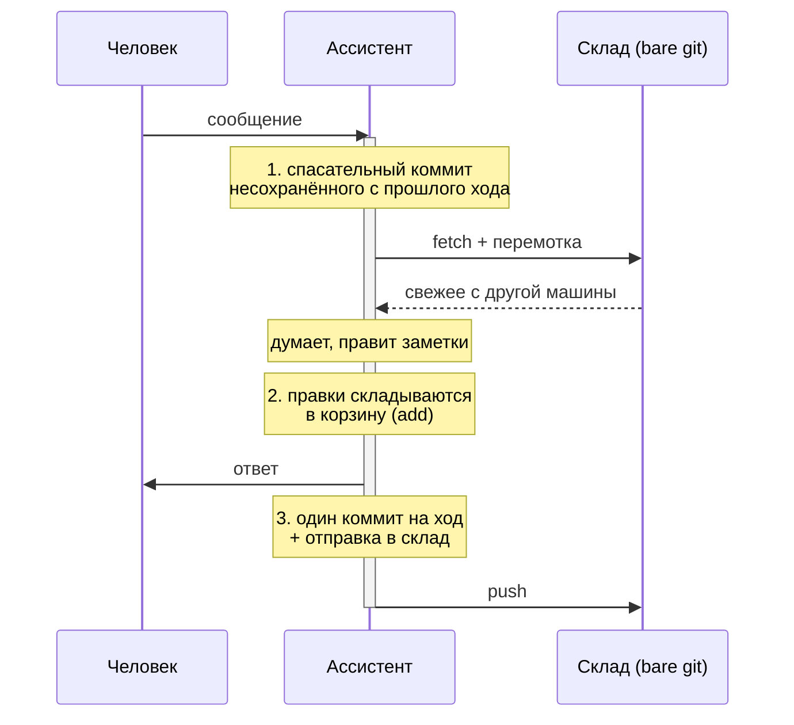

# Синхронизация: сервер и ноутбук, один ассистент

*Одни и те же заметки в двух местах, обмен после каждого сообщения, адрес склада нигде не зашит.*

---

## Зачем

Ассистент живёт в двух местах сразу: в мессенджере (на сервере, всегда включён) и в терминале на ноутбуке (когда вы за ним работаете). Это **один и тот же** ассистент: одна личность, одни правила, одни заметки.

Значит, заметки должны ездить туда-сюда сами. Иначе через день у вас две разошедшиеся копии, и вопрос «что мы вчера решили» получает два разных ответа.

---

## Схема: три движения на каждый ход

Обмен привязан не ко времени, а к разговору. На каждый ход — три действия:



**1. Взять свежее — до того, как человек заговорил.** Порядок жёсткий: спасательный коммит несохранённого → забрать с сервера → быстрая перемотка → слияние без правки → откат при конфликте.

Спасательный коммит стоит **перед** забором чужих изменений сознательно: если прошлый ход умер посередине, его правки висят в рабочей папке, и первое же слияние их затопчет. Коммит дёшев и обратим, потеря файла — нет.

**2. Складывать правки в корзину по ходу дела.** Каждая правка файла добавляется в набор изменений, но не коммитится. Иначе один ответ даёт пять коммитов, и журнал превращается в кашу.

**3. Один коммит на ход и отправка.** В конце — ровно один коммит со всеми правками. Отправка идёт даже когда коммитить нечего: рабочая копия могла отстать, пока шёл длинный ответ.

---

## Адаптивный адрес склада

Самая ценная часть, которая появилась после трёх месяцев тихой поломки.

**Как было.** В крюке синхронизации стояло `git push origin main` — жёстко. У одного из ботов склад назывался иначе, и синхронизация падала **три месяца подряд**: 792 записи в журнале ошибок, на которые никто не смотрел. Бот при этом бодро отвечал, заметки писал, а наружу не отдавал ничего.

**Как стало.** Адрес спрашивается по цепочке, три источника в строгом порядке старшинства:

| Приоритет | Источник | Когда срабатывает |
|---|---|---|
| 1 | переменные среды `SYNC_REMOTE` / `SYNC_BRANCH` | ручное вмешательство, старше всего |
| 2 | профиль хозяина (`git_remote`, `git_branch`) | явная воля хозяина |
| 3 | **опрос самого git** — перебор известных имён, текущая ветка | ничего не задано |

Зашитого имени склада в коде нет и быть не может: **адрес — свойство стенда, а не кода.** Именно поэтому один и тот же пакет синхронизации раскатывается на любое число машин без единой правки. У кого-то склад зовётся `origin`, у кого-то иначе, у кого-то ветка не `main` — код это выясняет сам.

Это и есть смысл слова «адаптивный»: пакет подстраивается под стенд, а не стенд под пакет.

---

## Пакет синхронизации

Четыре файла, эталон лежит рядом с ядром и раскатывается на все машины с заменой:

| Файл | Когда срабатывает | Что делает |
|---|---|---|
| `_sync-env.sh` | подключается остальными | находит хранилище, определяет адрес склада, готовит среду |
| `sync-pull.sh` | перед ходом | спасательный коммит, забор свежего, безопасное слияние |
| `sync-commit.sh` | после каждой правки файла | складывает в корзину, не коммитит |
| `sync-flush.sh` | в конце хода | один коммит + отправка |

Ноутбук использует те же самые файлы. Разница только в том, что там нет профиля — адрес определяется третьим способом, опросом git.

---

## Что делает эту схему живучей

**Ход не должен падать из-за сети.** Все операции с git обёрнуты так, что сбой связи не роняет разговор: не смогли забрать — работаем с тем, что есть, отправим в следующий раз. Ассистент, который молчит из-за упавшего интернета, бесполезнее ассистента с чуть устаревшими заметками.

**Никаких вопросов в терминале.** Запрос пароля намертво выключен: крюк, который ждёт ввода, вешает весь ход. Короткие таймауты на связь — по той же причине.

**Логи разговоров пишутся в разные файлы.** Мессенджер пишет в файл дня с одним именем, терминал — с другим. Иначе две машины затирают друг другу один файл, и половина разговоров исчезает. Оба файла индексируются поиском, так что на вопрос «что мы обсуждали в среду» найдётся и то, и другое.

**Спасательный коммит.** Отдельно стоит повторить: он спас не одну ночную сессию, когда процесс умирал посреди хода. Правки, висящие в рабочей папке, — самое хрупкое место любой автоматической синхронизации.

---

## Установка на второй машине

```bash
# 1. Забрать хранилище со склада
git clone <адрес склада> ~/vault && cd ~/vault

# 2. Положить пакет синхронизации туда, где его найдёт Claude Code
mkdir -p .claude/hooks && cp <ядро>/deploy/sync-hooks/*.sh .claude/hooks/
chmod +x .claude/hooks/*.sh

# 3. Прописать крюки в настройках Claude Code:
#    UserPromptSubmit → sync-pull.sh
#    PostToolUse (Write|Edit|MultiEdit) → sync-commit.sh
#    Stop → sync-flush.sh

# 4. Проверить, куда машина на самом деле синхронизируется
SYNC_DEBUG=1 .claude/hooks/sync-pull.sh
```

Поиск по заметкам ставится отдельно и своим индексом — он машинно-зависимый и через склад не ездит. Настройка — в [rag-search.md](rag-search.md).
